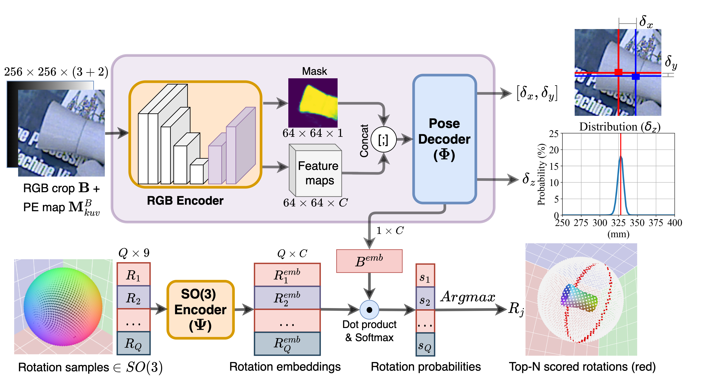

# SC6D: Symmetry-agnostic and Correspondence-free 6D Object Pose Estimation (3DV 2022)
- [Paper](https://arxiv.org/abs/2208.02129)
<p align="center">
    
</p>

``` Bash
@inproceedings{cai2022sc6d,
  title={SC6D: Symmetry-agnostic and Correspondence-free 6D Object Pose Estimation},
  author={Cai, Dingding and Heikkil{\"a}, Janne and Rahtu, Esa},
  booktitle={2022 International Conference on 3D Vision (3DV)},
  year={2022},
  organization={IEEE}
}
```

## Setup
Please start by installing [Miniconda3](https://conda.io/projects/conda/en/latest/user-guide/install/linux.html) with Pyhton3.8 or above.

``` Bash
git clone https://github.com/dingdingcai/SC6D-pose.git
cd SC6D-pose
unzip bop22_default_detections_and_segmentations.zip  ## detection results provided by the BOP Challenge 2022
conda env create -f environment.yml
conda activate sc6d
pip install torch==1.8.0+cu111 torchvision==0.9.0+cu111 -f https://download.pytorch.org/whl/torch_stable.html
pip install "git+https://github.com/facebookresearch/pytorch3d.git"
python -m pip install detectron2 -f https://dl.fbaipublicfiles.com/detectron2/wheels/cu111/torch1.8/index.html
```

## Dataset
Our evaluation is conducted on three benchmark datasets all downloaded from [BOP website](https://bop.felk.cvut.cz/datasets). All three datasets are stored in the same directory, e.g. ``BOP_Dataset/tless, BOP_Dataset/ycbv, BOP_Dataset/itodd``, and set the "DATASET_ROOT" (in config.py) to the BOP_Dataset directory.

## Denpendencies
This project requires the evaluation code from [bop_toolkit](https://github.com/thodan/bop_toolkit).


## Quantitative Evaluation
Evaluation on the model trained using only PBR images.
- ``python inference.py --dataset_name tless --gpu_id 0``
Evaluation on the model first trained using the PBR images and finetuned with the combined Synt+Real images
- ``python inference.py --dataset_name tless --gpu_id 0 --eval_finetune``

## Training
To train SC6D, download the [VOC2012](http://host.robots.ox.ac.uk/pascal/VOC/voc2012/VOCtrainval_11-May-2012.tar) dataset and set the "VOC_BG_ROOT" (in config.py) to the VOC2012 directory
- ``bash training.sh``  # change the "NAME" variable for training different dataset.


# Acknowledgement
- 1. The code is partially based on [GDR-Net](https://github.com/THU-DA-6D-Pose-Group/GDR-Net) and [OVE6D](https://github.com/dingdingcai/OVE6D-pos) .
- 2. The evaluation code is based on [bop_toolkit](https://github.com/thodan/bop_toolkit).


